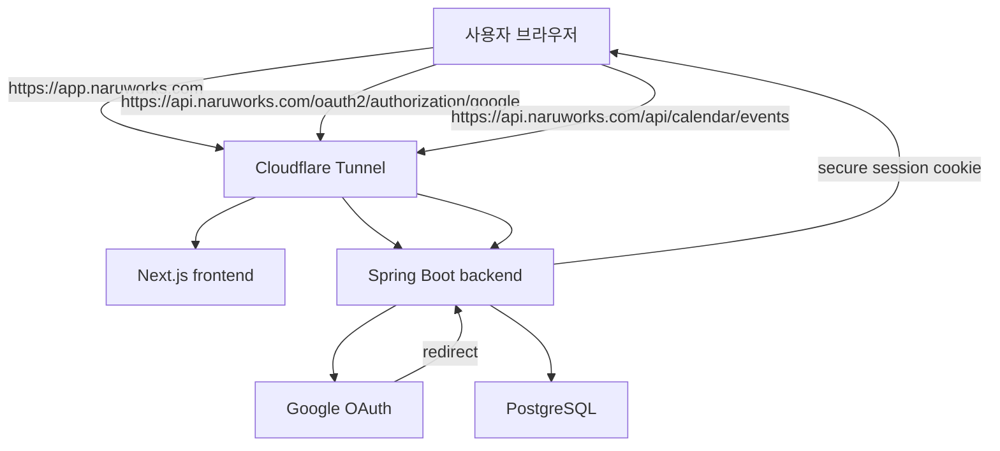
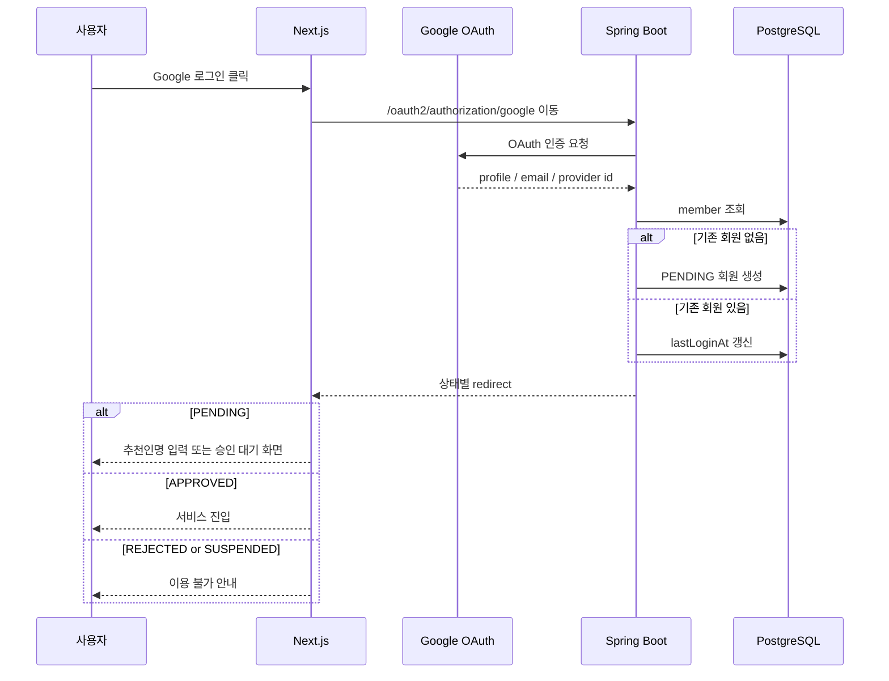
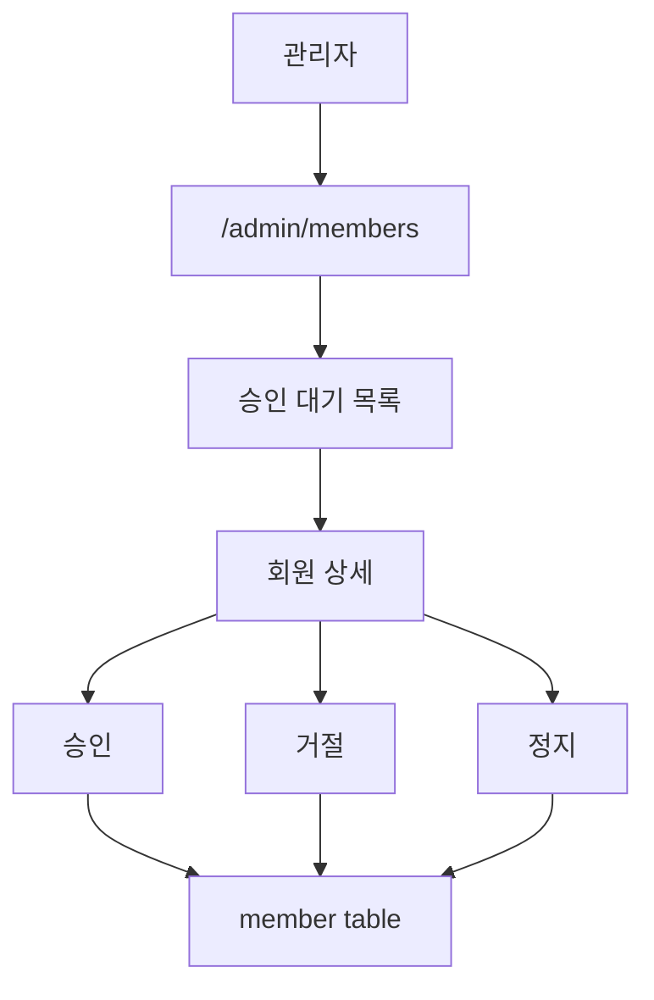
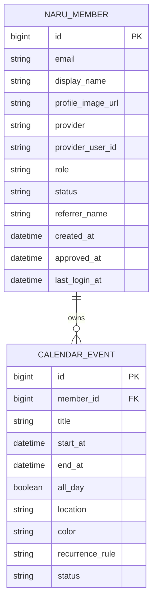

# Auth & Membership: Google Login + Approval

## 목적

NaruWorks는 개인 홈서버 기반 서비스 플랫폼이지만, 운영 대상은 개발자 본인만이 아니다.
지인과 가까운 사용자가 점진적으로 들어와 Calendar, Drive, Docs 같은 서비스를 함께 사용할 수 있어야 한다.

따라서 NaruWorks의 인증/인가 방향은 아래를 기준으로 한다.

```text
Google 로그인으로 가입 요청을 만든다.
운영자가 사용자를 승인한 뒤에만 서비스를 사용할 수 있다.
각 사용자는 자기 데이터만 조회/생성/수정/삭제할 수 있다.
```

## 핵심 결정

초기 회원가입은 별도 비밀번호 기반 가입 폼을 만들지 않는다.

대신 아래 흐름을 사용한다.

```text
Google 로그인 = NaruWorks 가입 요청
```

사용자는 Google 계정으로 로그인하고, NaruWorks는 Google에서 받은 식별 정보를 기반으로 내부 회원을 생성한다.
신규 회원의 최초 상태는 `PENDING`이다.

운영자는 관리자 화면에서 가입 대기 사용자를 확인하고 승인 또는 거절한다.

## 추천인명

신규 사용자는 가입 요청 과정에서 `추천인명`을 입력할 수 있다.

추천인명은 초기에는 자유 텍스트로 저장한다.

```text
referrerName
= 가입자가 "누구의 소개로 들어왔는지" 적는 값
= 예: 방호배, 김나루, 회사 동료 홍길동
```

초기에는 추천인을 기존 회원 id와 강하게 연결하지 않는다.
이유는 아래와 같다.

```text
1. 아직 회원 수가 적고 운영자가 직접 확인할 수 있다.
2. 추천인이 반드시 기존 가입자일 필요는 없다.
3. 승인 과정에서 운영자가 맥락을 판단하는 보조 정보면 충분하다.
```

나중에 추천 구조가 중요해지면 아래처럼 확장할 수 있다.

```text
referrerMemberId
= 기존 회원을 직접 참조하는 추천인 id
```

## 회원 상태

회원은 role과 status를 분리한다.

### Role

```text
USER
= 일반 사용자

ADMIN
= 운영자
```

### AccountStatus

```text
PENDING
= Google 로그인은 완료했지만 아직 승인 대기

APPROVED
= 서비스 사용 가능

REJECTED
= 가입 거절

SUSPENDED
= 기존 회원 이용 정지
```

role과 status를 분리하는 이유:

```text
APPROVED + USER
= 일반 사용자

APPROVED + ADMIN
= 관리자

PENDING + USER
= 로그인은 했지만 서비스 사용 불가

SUSPENDED + USER
= 기존 사용자를 임시 차단
```

## 권장 인증 구조

NaruWorks는 장기적으로 사용자가 점진적으로 늘어나는 서비스 플랫폼을 목표로 한다.
따라서 backend API도 독립된 진입점을 가져야 한다.

권장 공개 도메인 구조:

```text
app.naruworks.com
= Next.js frontend

api.naruworks.com
= Spring Boot backend API
```

Cloudflare Tunnel Public Hostname:

```text
app.naruworks.com -> http://frontend:3000
api.naruworks.com -> http://backend:8080
```

인증/인가는 Spring Boot backend가 중심이 된다.
frontend는 화면과 사용자 경험을 담당하고, 회원 상태/권한/Calendar 데이터 소유권 판단은 backend에서 일관되게 처리한다.



이 구조의 장점:

```text
1. backend API가 독립 서비스처럼 성장할 수 있다.
2. frontend가 API마다 Next.js proxy route를 만들 필요가 없다.
3. 모바일 앱이나 다른 클라이언트가 붙기 쉽다.
4. Spring Security가 Google 로그인, session, 권한을 일관되게 책임질 수 있다.
5. Calendar, Drive, Docs의 접근 정책을 backend 한 곳에서 관리할 수 있다.
```

주의할 점:

```text
api.naruworks.com을 외부에 공개하므로 Spring Security 설정이 필수다.
frontend origin인 https://app.naruworks.com만 CORS 허용한다.
session cookie는 HTTPS 전용으로 설정한다.
Google OAuth redirect URI를 api.naruworks.com 기준으로 등록한다.
```

초기 CORS 기준:

```text
Allowed Origin: https://app.naruworks.com
Allowed Credentials: true
Allowed Methods: GET, POST, PUT, DELETE, OPTIONS
```

초기 cookie 기준:

```text
Secure=true
HttpOnly=true
SameSite=Lax 우선 검토
필요 시 Domain=.naruworks.com 검토
```

Google OAuth redirect URI 후보:

```text
Local:
http://localhost:8081/login/oauth2/code/google

Production:
https://api.naruworks.com/login/oauth2/code/google
```

기존 Next.js API Route 프록시는 배포 초기 Calendar 저장 실패를 해결하기 위한 임시 구조로 본다.
인증/인가 도입 이후에는 Calendar API 호출도 `https://api.naruworks.com`으로 정리한다.

## 신규 가입 흐름



## 추천인명 입력 흐름

추천인명은 최초 Google 로그인 이후 입력한다.

```text
1. 사용자가 Google 로그인
2. 신규 사용자라면 PENDING 회원 생성
3. /join/pending 또는 /join/request 화면으로 이동
4. 추천인명 입력
5. 가입 요청 메시지 저장
6. 운영자가 관리자 화면에서 확인
```

추천인명은 필수값으로 둘지 선택값으로 둘지 구현 전에 결정한다.
초기 추천은 선택값이다.

이유:

```text
운영자가 직접 지인을 확인하는 서비스이므로 추천인명이 없어도 승인할 수 있다.
사용자가 Google 로그인 후 입력 장벽 때문에 이탈하지 않게 한다.
```

## 관리자 승인 흐름



관리자 화면 1차 기능:

```text
승인 대기 회원 목록 조회
회원 email/name/profile/referrerName 확인
승인 처리
거절 처리
정지 처리
```

## 서비스 접근 규칙

초기 접근 규칙:

```text
/calendar
= APPROVED 회원만 접근 가능

/api/calendar/**
= APPROVED 회원만 접근 가능

/admin/**
= APPROVED + ADMIN 회원만 접근 가능

/join/pending
= PENDING 회원 접근 가능
```

비로그인 사용자는 Calendar에 접근할 수 없다.
승인 대기 사용자는 로그인은 가능하지만 Calendar 데이터를 볼 수 없다.

## Calendar 데이터 소유권

인증 도입 후 CalendarEvent는 반드시 owner를 가진다.

```text
calendar_event.member_id
= 일정을 소유한 회원 id
```

조회:

```text
내 일정만 조회
```

생성:

```text
로그인한 회원 id를 owner로 저장
```

수정/삭제:

```text
내 일정만 수정/삭제 가능
ADMIN이라도 초기에는 사용자 일정 임의 수정 기능을 제공하지 않는다.
```



## Backend 모듈 배치

현재 backend 멀티 모듈 기준 배치는 아래를 따른다.

```text
naru-domain
- Member
- MemberRole
- MemberStatus
- AuthProvider

naru-core
- MemberService
- MembershipApprovalService
- CurrentMember
- MemberReader
- MemberWriter
- UnauthorizedException
- ForbiddenException

naru-infrastructure
- MemberEntity
- MemberJpaRepository
- MemberPersistenceAdapter
- Flyway migration

naru-api
- AuthController 또는 MemberController
- AdminMemberController
- 인증 관련 DTO
- Security/Web config
- GlobalExceptionHandler 확장
```

## Frontend 배치

```text
frontend/src/app/login/page.tsx
= 로그인 화면

frontend/src/app/join/pending/page.tsx
= 승인 대기 / 추천인명 입력 화면

frontend/src/app/admin/members/page.tsx
= 관리자 회원 승인 화면

frontend/src/lib/api-client.ts
= api.naruworks.com 호출 공통 client

frontend middleware 또는 server component guard
= 비로그인/미승인 사용자 redirect
```

Google OAuth 처리 자체는 backend Spring Security가 담당한다.
frontend는 로그인 버튼을 backend OAuth 시작 URL로 연결한다.

```text
https://api.naruworks.com/oauth2/authorization/google
```

## 보안 원칙

1. backend는 `api.naruworks.com`으로 공개하되 모든 보호 API에 인증/인가를 적용한다.
2. DB 포트는 외부에 공개하지 않는다.
3. 실제 Google OAuth secret, session secret은 `.env`에만 저장한다.
4. `.env.example`에는 예시값만 둔다.
5. PENDING/REJECTED/SUSPENDED 회원은 Calendar API에 접근할 수 없다.
6. CalendarEvent는 member_id 기준으로 항상 필터링한다.
7. 관리자 화면은 ADMIN role만 접근 가능하다.

## 이후 확장 후보

```text
초대 코드
추천인 member 연결
Cloudflare Access 기반 관리자 보호
사용자별 서비스 권한
조직/그룹
공유 캘린더
사용자 프로필 편집
로그인 감사 로그
```
