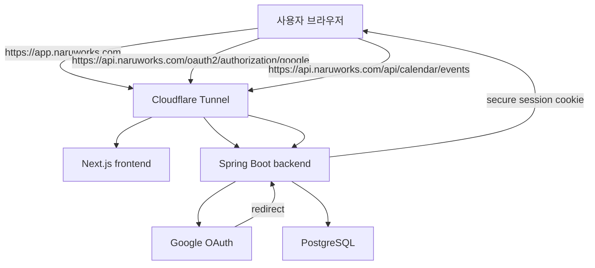
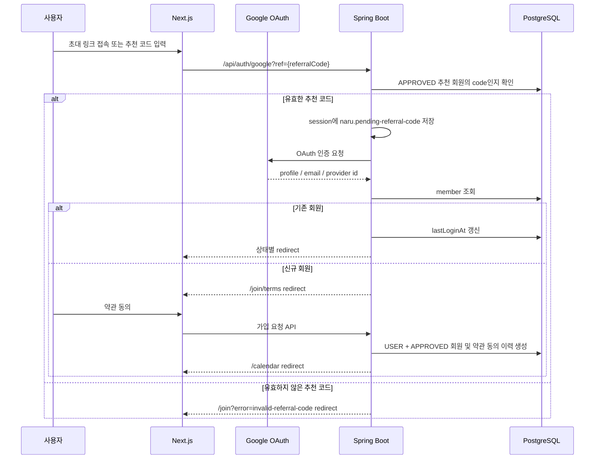
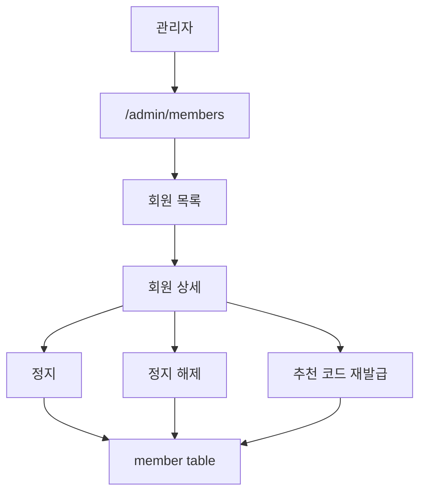
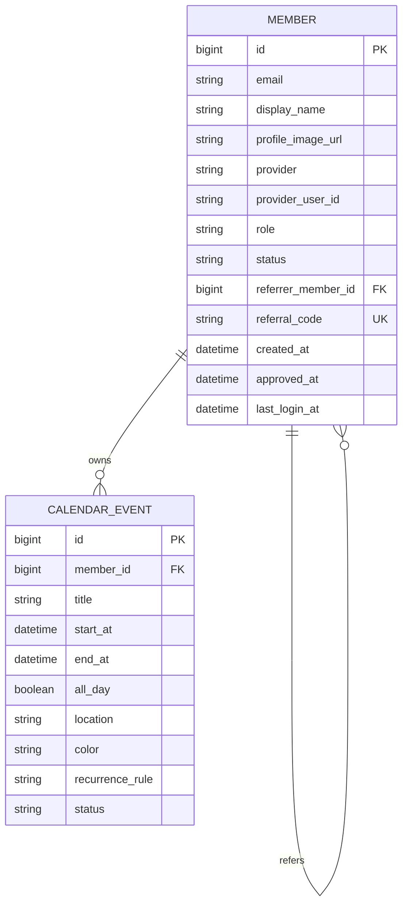

# Auth & Membership: Google Login + Approval

## 목적

NaruWorks는 개인 홈서버 기반 서비스 플랫폼이지만, 운영 대상은 개발자 본인만이 아니다.
지인과 가까운 사용자가 점진적으로 들어와 Calendar, Drive, Docs 같은 서비스를 함께 사용할 수 있어야 한다.

따라서 NaruWorks의 인증/인가 방향은 아래를 기준으로 한다.

```text
Google 로그인으로 가입 요청을 만든다.
운영자가 사용자를 승인한 뒤에만 서비스를 사용할 수 있다.
각 사용자는 자기 데이터만 조회/생성/수정/삭제할 수 있다.
```

## 핵심 결정

초기 회원가입은 별도 비밀번호 기반 가입 폼을 만들지 않는다.

대신 아래 흐름을 사용한다.

```text
유효한 초대 코드 + Google 로그인 + 약관 동의 = NaruWorks 가입
```

신규 사용자는 유효한 초대 링크 또는 추천 코드가 있어야만 Google 로그인을 시작할 수 있다.
Google 로그인 성공만으로는 내부 회원을 생성하지 않고, `/join/terms`에서 약관 동의를 완료한 시점에만 내부 회원을 생성한다.

일반 초대 회원은 약관 동의가 완료되면 즉시 `APPROVED` 상태로 생성된다.
운영자는 회원을 조회·정지하고 추천 코드 운영을 관리한다.

## 추천 관계와 초대

추천인은 회원 관계로 관리한다. 자유 텍스트 추천인명은 동명이인, 오타, 이름 변경 때문에 추천 관계의 기준값으로 사용하지 않는다.

```text
members.referrer_member_id
= 가입자를 초대한 기존 회원의 members.id를 참조하는 자기 참조 외래 키

members.referral_code
= 회원별 고유 추천 코드
= 영문 대문자와 숫자로 구성된 6자리 값 (예: AB12CD)

초대 링크
= https://app.naruworks.com/join?ref={referralCode}
```

추천 코드는 관계를 연결하기 위한 공개 식별자이고, 실제 관계의 기준값은 `referrer_member_id`다.
이 구조를 사용하면 추천인별 가입자 수, 승인 전환율, 여러 단계의 추천 관계를 정확하게 조회할 수 있다.

초기 정책:

```text
추천인은 APPROVED 회원만 될 수 있다.
한 회원은 한 명의 추천인만 가진다.
추천 관계는 회원 생성 시 한 번만 설정하고 이후에는 변경하지 않는다.
추천 코드는 영문 대문자와 숫자로 구성된 6자리 임의 값으로 생성하고 unique 제약조건을 둔다.
초대 링크 또는 추천 코드가 없는 신규 사용자는 Google 로그인을 시작할 수 없다.
유효한 초대 코드와 약관 동의가 완료된 일반 초대 회원은 USER + APPROVED 상태로 생성한다.
```

사용자 경험은 초대 링크를 기본으로 한다.

```text
기존 회원: 초대 링크 복사 후 공유
신규 회원: app.naruworks.com/join?ref=... 링크 클릭 -> 추천 코드 검증 -> Google 로그인 -> 약관 동의 -> 가입 요청 생성
예외 상황: /join 화면에서 추천 코드 직접 입력 후 Google 로그인
```

Google OAuth 과정에서는 frontend query parameter가 그대로 유지되지 않으므로, backend가 추천 코드를 session에 임시 보관해야 한다.
Spring Security가 CSRF 방지용으로 관리하는 OAuth `state`에는 추천 코드를 넣지 않는다.

```text
GET /api/auth/google?ref={referralCode}
-> 유효한 추천 코드인지 확인
-> HttpSession attribute naru.pending-referral-code에 보관
-> /oauth2/authorization/google으로 redirect
-> OAuth 성공 handler는 회원을 만들지 않고 /join/terms로 redirect
-> 약관 동의 API가 session의 code를 읽어 회원 관계와 함께 Member를 생성
```

## 회원 상태

회원은 role과 status를 분리한다.

### Role

```text
USER
= 일반 사용자

ADMIN
= 운영자
```

### AccountStatus

```text
PENDING
= 향후 운영자 직접 검토 가입 경로를 위한 예약 상태

APPROVED
= 서비스 사용 가능

REJECTED
= 가입 거절

SUSPENDED
= 기존 회원 이용 정지
```

role과 status를 분리하는 이유:

```text
APPROVED + USER
= 일반 사용자

APPROVED + ADMIN
= 관리자

SUSPENDED + USER
= 기존 사용자를 임시 차단
```

## 권장 인증 구조

NaruWorks는 장기적으로 사용자가 점진적으로 늘어나는 서비스 플랫폼을 목표로 한다.
따라서 backend API도 독립된 진입점을 가져야 한다.

권장 공개 도메인 구조:

```text
app.naruworks.com
= Next.js frontend

api.naruworks.com
= Spring Boot backend API
```

Cloudflare Tunnel Public Hostname:

```text
app.naruworks.com -> http://frontend:3000
api.naruworks.com -> http://backend:8080
```

인증/인가는 Spring Boot backend가 중심이 된다.
frontend는 화면과 사용자 경험을 담당하고, 회원 상태/권한/Calendar 데이터 소유권 판단은 backend에서 일관되게 처리한다.



이 구조의 장점:

```text
1. backend API가 독립 서비스처럼 성장할 수 있다.
2. frontend가 API마다 Next.js proxy route를 만들 필요가 없다.
3. 모바일 앱이나 다른 클라이언트가 붙기 쉽다.
4. Spring Security가 Google 로그인, session, 권한을 일관되게 책임질 수 있다.
5. Calendar, Drive, Docs의 접근 정책을 backend 한 곳에서 관리할 수 있다.
```

주의할 점:

```text
api.naruworks.com을 외부에 공개하므로 Spring Security 설정이 필수다.
frontend origin인 https://app.naruworks.com만 CORS 허용한다.
session cookie는 HTTPS 전용으로 설정한다.
Google OAuth redirect URI를 api.naruworks.com 기준으로 등록한다.
```

초기 CORS 기준:

```text
Allowed Origin: https://app.naruworks.com
Allowed Credentials: true
Allowed Methods: GET, POST, PUT, DELETE, OPTIONS
```

초기 cookie 기준:

```text
Secure=true
HttpOnly=true
SameSite=Lax 우선 검토
필요 시 Domain=.naruworks.com 검토
```

Google OAuth redirect URI 후보:

```text
Local:
http://localhost:8081/login/oauth2/code/google

Production:
https://api.naruworks.com/login/oauth2/code/google
```

기존 Next.js API Route 프록시는 배포 초기 Calendar 저장 실패를 해결하기 위한 임시 구조로 본다.
인증/인가 도입 이후에는 Calendar API 호출도 `https://api.naruworks.com`으로 정리한다.

## 신규 가입 흐름



## 추천 코드 입력 흐름

초대 링크를 받은 사용자는 Google 로그인 전에 추천 코드가 자동으로 검증·저장된다.
초대 링크 없이 가입하려는 사용자는 `/join` 화면에서 추천 코드를 입력해야 한다.

```text
1. 사용자가 app.naruworks.com/join?ref={referralCode}로 접근
2. frontend가 api.naruworks.com/api/auth/google?ref={referralCode}로 이동
3. backend가 code를 검증하고 HttpSession의 naru.pending-referral-code에 임시 보관
4. Google 로그인 성공 후 기존 회원 여부를 조회
5. 기존 회원이 없으면 /join/terms 화면으로 이동하며, 이 시점에는 DB 회원을 만들지 않음
6. 약관 동의 API가 session의 referral code로 APPROVED 추천인을 조회
7. 가입자의 referrer_member_id와 새 referral_code를 포함해 USER + APPROVED Member를 처음 생성
8. /calendar 화면으로 이동
```

추천 코드는 신규 가입에 필수다. 초대 코드 없이 일반 Google 로그인을 시도한 신규 사용자는 회원을 생성하지 않고 session을 종료한 뒤 `/join?error=invitation-required`로 이동한다.

## 최초 운영자 Bootstrap

초대 링크를 발급할 첫 회원이 필요하므로, 최초 운영자만 제한적으로 초대 코드 없이 생성할 수 있다.

```text
조건
1. NARU_INITIAL_ADMIN_EMAIL 환경변수와 Google email이 같다.
2. members 테이블이 완전히 비어 있다.
3. 약관 동의 API를 제출했다.

생성 결과
role = ADMIN
status = APPROVED
referrer_member_id = null
referral_code = 새 6자리 코드
```

최초 운영자 생성 후에는 `NARU_INITIAL_ADMIN_EMAIL`을 운영 환경에서 제거한다.

## 관리자 회원 관리 흐름



관리자 화면 1차 기능:

```text
회원 email/name/profile/referrerMember 확인
정지 처리
정지 해제 처리
추천 코드 재발급·폐기
```

## 서비스 접근 규칙

초기 접근 규칙:

```text
/calendar
= APPROVED 회원만 접근 가능

/api/calendar/**
= APPROVED 회원만 접근 가능

/admin/**
= APPROVED + ADMIN 회원만 접근 가능

/join/terms
= 유효한 초대 코드로 Google 로그인을 완료했지만 아직 회원이 아닌 사용자 접근 가능
```

비로그인 사용자는 Calendar에 접근할 수 없다.
정상 초대 회원은 약관 동의 완료 후 즉시 Calendar 데이터를 이용할 수 있다.

## Calendar 데이터 소유권

인증 도입 후 CalendarEvent는 반드시 owner를 가진다.

```text
calendar_event.member_id
= 일정을 소유한 회원 id
```

조회:

```text
내 일정만 조회
```

생성:

```text
로그인한 회원 id를 owner로 저장
```

수정/삭제:

```text
내 일정만 수정/삭제 가능
ADMIN이라도 초기에는 사용자 일정 임의 수정 기능을 제공하지 않는다.
```



## Backend 모듈 배치

현재 backend 멀티 모듈 기준 배치는 아래를 따른다.

```text
naru-domain
- Member
- MemberRole
- MemberStatus
- AuthProvider

naru-core
- MemberService
- MembershipApprovalService
- CurrentMember
- MemberReader
- MemberWriter
- UnauthorizedException
- ForbiddenException

naru-infrastructure
- MemberEntity
- MemberJpaRepository
- MemberPersistenceAdapter
- Flyway migration

naru-api
- AuthController 또는 MemberController
- AdminMemberController
- 인증 관련 DTO
- Security/Web config
- GlobalExceptionHandler 확장
```

## Frontend 배치

```text
frontend/src/app/login/page.tsx
= 로그인 화면

frontend/src/app/join/pending/page.tsx
= 향후 운영자 직접 검토 가입 경로를 위한 예약 화면

frontend/src/app/join/page.tsx
= 초대 링크의 ref query parameter 확인 또는 추천 코드 입력 후 backend OAuth 시작 주소로 이동하는 진입 화면

frontend/src/app/join/terms/page.tsx
= Google 로그인은 완료됐지만 아직 회원이 아닌 사용자의 약관 동의 화면

frontend/src/app/admin/members/page.tsx
= 관리자 회원 승인 화면

frontend/src/lib/api-client.ts
= api.naruworks.com 호출 공통 client

frontend middleware 또는 server component guard
= 비로그인/미승인 사용자 redirect
```

Google OAuth 처리 자체는 backend Spring Security가 담당한다.
frontend는 로그인 버튼을 backend OAuth 시작 URL로 연결한다.

```text
https://api.naruworks.com/oauth2/authorization/google
```

## 보안 원칙

1. backend는 `api.naruworks.com`으로 공개하되 모든 보호 API에 인증/인가를 적용한다.
2. DB 포트는 외부에 공개하지 않는다.
3. 실제 Google OAuth secret, session secret은 `.env`에만 저장한다.
4. `.env.example`에는 예시값만 둔다.
5. PENDING/REJECTED/SUSPENDED 회원은 Calendar API에 접근할 수 없다.
6. CalendarEvent는 member_id 기준으로 항상 필터링한다.
7. 관리자 화면은 ADMIN role만 접근 가능하다.
8. 초대 코드 검증 API에는 rate limit을 적용한다.
9. 추천 코드는 입장 권한이므로 재발급·폐기 기능을 제공한다.

## 이후 확장 후보

```text
Cloudflare Access 기반 관리자 보호
사용자별 서비스 권한
조직/그룹
공유 캘린더
사용자 프로필 편집
로그인 감사 로그
```
