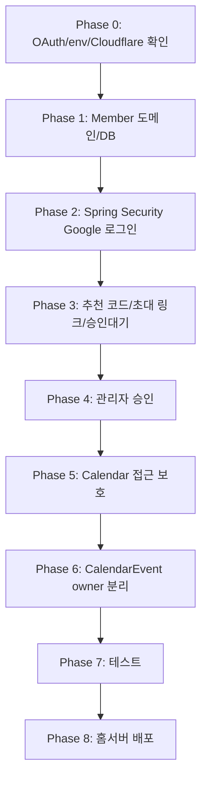

# Auth Approval Implementation Plan

## 목표

NaruWorks를 외부 도메인으로 배포한 뒤 Calendar 데이터가 누구에게나 보일 수 있다는 문제가 확인되었다.

이제 Calendar 기능을 더 확장하기 전에 인증/인가를 먼저 도입한다.

1차 목표:

```text
Google 로그인
가입 요청 생성
추천 코드/초대 링크 연결
운영자 승인
승인된 사용자만 Calendar 접근
사용자별 CalendarEvent 분리
```

## 우선순위

```text
1. 회원/승인 도메인 설계
2. Google 로그인 도입
3. 승인 대기/추천 코드 및 초대 링크 흐름
4. 관리자 승인 화면
5. Calendar 접근 보호
6. CalendarEvent owner 분리
7. 홈서버 재배포 및 검증
```

## Phase 0: 구현 전 확인

구현 전에 아래를 확인한다.

```text
1. Google Cloud Console 프로젝트 생성 가능 여부
2. OAuth Client ID / Client Secret 발급
3. Authorized redirect URI
4. Cloudflare Tunnel Public Hostname 추가 가능 여부
5. 배포 frontend 도메인: https://app.naruworks.com
6. 배포 backend 도메인: https://api.naruworks.com
7. 로컬 frontend 주소: http://localhost:3000
8. 로컬 backend 주소: http://localhost:8081
9. 홈서버 .env 관리 방식
```

필요 환경변수 후보:

```env
GOOGLE_CLIENT_ID=change_me
GOOGLE_CLIENT_SECRET=change_me
SPRING_SESSION_COOKIE_DOMAIN=change_me
NARU_ALLOWED_ORIGINS=https://app.naruworks.com
NARU_INITIAL_ADMIN_EMAIL=change_me
```

실제 값은 Git에 올리지 않는다.

Cloudflare Tunnel Public Hostname 목표:

```text
app.naruworks.com -> http://frontend:3000
api.naruworks.com -> http://backend:8080
```

Google OAuth redirect URI:

```text
Local:
http://localhost:8081/login/oauth2/code/google

Production:
https://api.naruworks.com/login/oauth2/code/google
```

## Phase 1: 회원 도메인 추가

### Backend domain

추가 후보:

```text
backend/naru-domain/src/main/java/com/naruworks/domain/model/Member.java
backend/naru-domain/src/main/java/com/naruworks/domain/type/MemberRole.java
backend/naru-domain/src/main/java/com/naruworks/domain/type/MemberStatus.java
backend/naru-domain/src/main/java/com/naruworks/domain/type/AuthProvider.java
```

Member 필드:

```text
id
email
displayName
profileImageUrl
provider
providerUserId
role
status
referrerMemberId
referralCode
createdAt
approvedAt
lastLoginAt
```

### Backend infrastructure

추가 후보:

```text
backend/naru-infrastructure/src/main/java/com/naruworks/infrastructure/persistence/member/MemberEntity.java
backend/naru-infrastructure/src/main/java/com/naruworks/infrastructure/persistence/member/MemberJpaRepository.java
backend/naru-infrastructure/src/main/java/com/naruworks/infrastructure/persistence/member/MemberPersistenceAdapter.java
```

Flyway migration:

```text
backend/naru-infrastructure/src/main/resources/db/migration/V6__create_members.sql
backend/naru-infrastructure/src/main/resources/db/migration/V7__rename_naru_members_to_members.sql
```

DB 주석 원칙:

```text
테이블 COMMENT 작성
모든 컬럼 COMMENT 작성
```

### Backend core

추가 후보:

```text
MemberService
MembershipApprovalService
CurrentMember
MemberReader
MemberWriter
```

책임:

```text
Google provider 정보로 기존 회원 조회
추천 코드로 추천 회원 조회 및 연결
약관 동의 완료 시점에만 신규 Member 생성
회원 상태 변경
현재 회원 접근 가능 여부 판단
```

## Phase 2: Backend Google 로그인

추가 후보:

```text
backend/naru-api/build.gradle
backend/naru-api/src/main/java/com/naruworks/api/config/SecurityConfig.java
backend/naru-api/src/main/java/com/naruworks/api/config/CorsConfig.java
backend/naru-core/src/main/java/com/naruworks/core/service/OAuthMemberService.java
```

의존성 후보:

```text
spring-boot-starter-security
spring-boot-starter-oauth2-client
```

backend 책임:

```text
Google OAuth2 Login 시작
OAuth callback 처리
Google profile 기반 기존 Member 조회
신규 사용자는 /join/terms로 이동하고 약관 동의 API에서만 Member 생성
PENDING/APPROVED/REJECTED/SUSPENDED 상태별 redirect
session cookie 발급
CORS credentials 허용
```

로그인 성공 후 redirect 후보:

```text
APPROVED -> /calendar
PENDING -> /join/pending
REJECTED -> /join/rejected
SUSPENDED -> /join/suspended
```

frontend 로그인 버튼:

```text
기존 회원 로그인: https://api.naruworks.com/oauth2/authorization/google
신규 가입: https://app.naruworks.com/join 또는 초대 링크
```

## Phase 3: 가입 대기 + 추천 코드/초대 링크

추가 후보:

```text
frontend/src/app/join/pending/page.tsx
frontend/src/app/join/page.tsx
frontend/src/lib/api-client.ts
```

화면 기능:

```text
추천 코드 입력 또는 초대 링크 ref 확인
유효한 추천 코드일 때만 Google 로그인 시작
Google 로그인 후 /join/terms 화면 표시
약관 동의 후에만 가입 요청 생성
PENDING 회원에게 승인 대기 상태 안내
```

backend API 후보:

```text
GET /api/members/me
GET /api/auth/google?ref={referralCode}
POST /api/registrations
GET /api/members/me/invitation
```

frontend는 `https://api.naruworks.com`을 직접 호출한다.
쿠키 기반 session을 사용할 경우 credentials를 포함해야 한다.

```ts
fetch("https://api.naruworks.com/api/members/me", {
  credentials: "include",
});
```

추천 코드 validation:

```text
앞뒤 공백 trim
영문 대문자와 숫자 6자리 형식 확인
유효한 APPROVED 회원의 referralCode인지 확인
초대 코드가 없는 신규 사용자는 OAuth 시작 불가
```

초기 추천:

```text
초대 링크를 기본 흐름으로 제공
추천 코드 직접 입력은 초대 링크가 없을 때의 필수 보조 수단으로 제공
```

DB migration:

```text
V8__add_member_referral_relation.sql
members.referrer_member_id 추가
members.referral_code 추가
referrer_member_id -> members.id 외래 키 추가
referrer_member_id index 추가
referral_code unique 제약조건 추가
기존 referrer_name 컬럼 제거
```

OAuth 추천 코드 보존:

```text
초대 링크는 https://app.naruworks.com/join?ref={referralCode} 형식으로 공유한다.
frontend의 /join 화면이 GET /api/auth/google?ref=... 주소로 브라우저를 이동시킨다.
초대 링크의 ref query parameter는 Google OAuth 왕복 후 유지되지 않으므로, backend가 referral code를 session에 임시 저장한다.
추천 코드는 OAuth state가 아니라 HttpSession attribute naru.pending-referral-code에 저장한다.
OAuth 성공 handler는 신규 Member를 만들지 않고 /join/terms로 이동시킨다.
POST /api/registrations가 session의 referral code로 추천 관계와 Member를 함께 생성한다.
```

최초 운영자 bootstrap:

```text
NARU_INITIAL_ADMIN_EMAIL과 Google email이 같고 members 테이블이 비어 있을 때만 초대 코드 없이 가입을 허용한다.
최초 운영자는 약관 동의 후 ADMIN + APPROVED로 생성하며 referrer_member_id는 null이다.
최초 운영자 생성 후 NARU_INITIAL_ADMIN_EMAIL은 운영 환경에서 제거한다.
```

## Phase 4: 관리자 승인

추가 후보:

```text
frontend/src/app/admin/members/page.tsx
backend/naru-api/src/main/java/com/naruworks/api/controller/AdminMemberController.java
```

backend API 후보:

```text
GET /api/admin/members?status=PENDING
POST /api/admin/members/{id}/approve
POST /api/admin/members/{id}/reject
POST /api/admin/members/{id}/suspend
```

관리자 화면 1차 기능:

```text
승인 대기 회원 목록
email
displayName
profileImageUrl
referrerMember
createdAt
승인 버튼
거절 버튼
```

관리자 권한:

```text
APPROVED + ADMIN만 접근 가능
```

초기 ADMIN 생성 방식은 구현 전에 결정한다.

후보:

```text
1. 첫 운영자 email을 환경변수로 지정
2. Flyway seed로 운영자 email 등록
3. DB에서 수동으로 role/status 변경
```

초기 추천:

```text
환경변수 NARU_INITIAL_ADMIN_EMAIL 사용
```

## Phase 5: Calendar 접근 보호

보호 대상:

```text
/calendar
https://api.naruworks.com/api/calendar/events
https://api.naruworks.com/api/calendar/events/{id}
```

접근 규칙:

```text
비로그인 -> /login
PENDING -> /join/pending
REJECTED -> /join/rejected
SUSPENDED -> /join/suspended
APPROVED -> 접근 가능
```

frontend는 `/calendar` 접근 시 현재 회원 API를 먼저 확인한다.
backend는 Calendar API에서 반드시 session과 승인 상태를 검증한다.

기존 Next.js API Route calendar proxy는 인증 도입 이후 제거하거나 compatibility layer로 남길지 결정한다.
장기 목표는 frontend가 `api.naruworks.com`을 직접 호출하는 구조다.

## Phase 6: CalendarEvent 사용자 분리

DB migration:

```text
V7__add_member_id_to_calendar_events.sql
```

변경:

```text
calendar_event.member_id 추가
member_id FK 설정
member_id index 추가
```

주의:

```text
기존 calendar_event 데이터가 있으면 소유자를 어떻게 지정할지 결정해야 한다.
```

초기 선택지:

```text
1. 기존 일정 모두 초기 ADMIN 소유로 migration
2. 기존 일정 삭제 후 새로 시작
3. migration 전에 운영 DB 수동 정리
```

홈서버 첫 운영 데이터가 많지 않다면 1번이 가장 안전하다.

Core 변경:

```text
CalendarService.listEvents(currentMemberId, from, to)
CalendarService.createEvent(currentMemberId, request)
CalendarService.updateEvent(currentMemberId, eventId, request)
CalendarService.deleteEvent(currentMemberId, eventId)
```

Infrastructure 변경:

```text
findByMemberIdAndPeriod(...)
findByIdAndMemberId(...)
```

## Phase 7: 테스트

Backend test:

```text
MemberJpaRepositoryTest
MemberServiceTest
AdminMemberApiIntegrationTest
CalendarEventApiIntegrationTest 사용자 분리 케이스 추가
```

Frontend test/manual check:

```text
비로그인 /calendar 접근 시 /login 이동
유효한 추천 코드가 있어야 신규 Google 로그인 시작
Google 로그인 직후 신규 회원이면 /join/terms 이동
약관 동의 API 성공 시 PENDING 회원 생성
ADMIN이 사용자 승인
APPROVED 사용자가 Calendar 접근
사용자 A 일정이 사용자 B에게 보이지 않음
```

## Phase 8: 홈서버 배포

배포 전 환경변수:

```env
GOOGLE_CLIENT_ID=...
GOOGLE_CLIENT_SECRET=...
NARU_ALLOWED_ORIGINS=https://app.naruworks.com
NARU_INITIAL_ADMIN_EMAIL=...
```

홈서버 실행:

```powershell
git pull origin main
docker compose down
docker compose up -d --build
docker compose ps
```

검증:

```text
https://app.naruworks.com/login
https://api.naruworks.com/actuator 또는 health 확인 후보
Google 로그인
승인 대기 화면
관리자 승인
Calendar CRUD
비로그인 Calendar 접근 차단
```

## 구현 순서 요약



## 우선 구현 범위

첫 번째 작업 단위는 아래로 제한한다.

```text
1. Member domain/type/entity/migration
2. Spring Security OAuth2 설정 초안
3. 초대 코드 검증 후 OAuth 시작
4. OAuth 성공 후 약관 동의 화면
5. 약관 동의 API에서 최초 PENDING 회원 생성
```

두 번째 작업 단위:

```text
1. 관리자 회원 목록
2. 승인/거절/정지
3. Calendar 페이지 접근 보호
```

세 번째 작업 단위:

```text
1. CalendarEvent member_id 추가
2. 사용자별 일정 분리
3. 통합 테스트 보강
4. 홈서버 배포 검증
```
