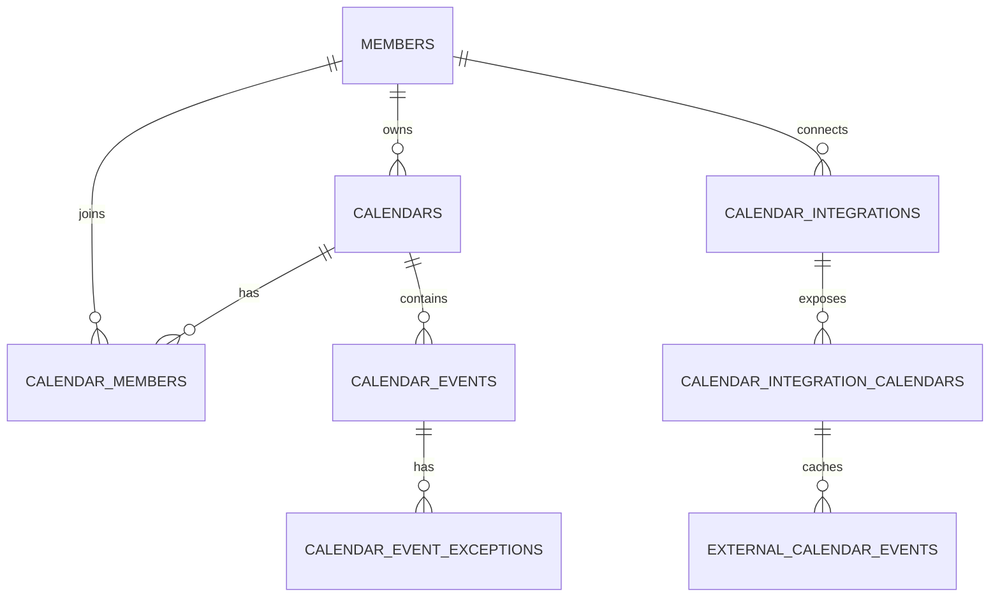

# Naru Calendar 도메인 모델

## 데이터 경계

```text
Naru 내부 일정
= 사용자가 NaruWorks에서 생성하고 권한에 따라 수정하는 일정

Google 외부 일정
= Google 원본을 읽기 전용 저장본으로 동기화한 일정
= 내부 일정과 같은 화면에 보이지만 수정·삭제 대상이 아님

공휴일·음력
= 회원 소유 일정이 아닌 날짜 메타데이터
```

## 핵심 관계



전체 컬럼과 실제 FK·index는 [관계 ERD](../../specs/erd-relations.md)를 기준으로 한다.

## 테이블별 책임

| 테이블 | 책임 | 중요한 규칙 |
| --- | --- | --- |
| `calendars` | 개인 또는 공유 일정 공간 | `owner_member_id`가 생성·관리 책임자. `display_color`, `is_default`를 가짐 |
| `calendar_members` | 회원의 캘린더 참여와 역할 | 한 회원은 같은 캘린더에 한 번만 참여. `OWNER`, `EDITOR`, `VIEWER` |
| `calendar_events` | Naru 내부 단일·기간·반복 일정 원본 | `calendar_id`에 속하고, `created_by_member_id`는 최초 생성자 |
| `calendar_event_exceptions` | 반복 일정의 특정 회차 취소 또는 덮어쓰기 | 원본 일정과 발생 시작 시각 조합은 유일 |
| `calendar_holiday_overrides` | 운영자가 공휴일 계산 결과를 ADD/REMOVE 하는 예외 | 회원 소유 데이터가 아님 |
| `calendar_integrations` | 회원과 Google 계정의 OAuth 연결 | refresh token은 암호화해서 보관하며 API 응답에 포함하지 않음 |
| `calendar_integration_calendars` | 연결 계정 안 하위 Google Calendar의 표시·동기화 지점 | `enabled`, 제공자 색상, `sync_token`을 관리 |
| `external_calendar_events` | Google Event의 읽기 전용 저장본 | 제공자 이벤트 ID로 upsert하고 내부 일정과 분리 |

## 내부 캘린더 권한

| 역할 | 일정 조회 | 일정 생성·수정·삭제 | 초대·구성원·색상 관리 | 소유권 이전·캘린더 삭제 |
| --- | --- | --- | --- | --- |
| `OWNER` | 가능 | 가능 | 가능 | 가능 |
| `EDITOR` | 가능 | 가능 | 불가 | 불가 |
| `VIEWER` | 가능 | 불가 | 불가 | 불가 |

개인 캘린더도 소유자가 `OWNER`로 참여한다. 개인 캘린더는 하나 이상 유지해야 하며, 기본 개인 캘린더를 삭제하면 남은 개인 캘린더 중 하나를 기본으로 승격한다.

## 공유 캘린더

- 공유는 이메일 입력이 아닌 역할별 초대 링크로 시작한다.
- 링크 원문은 URL로만 전달하고 DB에는 SHA-256 해시만 저장한다.
- 초대 링크는 7일 뒤 만료되며 수락할 때만 `calendar_members` 관계가 생긴다.
- OWNER만 링크 발급·폐기, 참여자 제거, 역할 변경, 소유권 이전을 할 수 있다.
- OWNER가 바뀌면 이전 OWNER가 발급한 활성 초대 링크는 폐기한다.

## 일정 규칙

- 새 일정은 편집 가능한 내부 캘린더를 저장 대상으로 선택한다. `VIEWER` 캘린더에는 생성할 수 없다.
- 일정 이동은 원래와 새 캘린더 모두 편집 권한이 있을 때만 허용한다.
- 종일 기간 일정은 사용자가 입력한 종료일을 포함해 표현하며, 저장 시 종료일 다음 날 00:00을 사용한다.
- 반복 원본의 개별 회차 예외는 원본과 별도로 저장한다. 개별 회차는 다른 캘린더로 이동할 수 없다.
- Google 외부 일정은 내부 `calendars`에 이관하지 않으며, 항상 읽기 전용이다.
