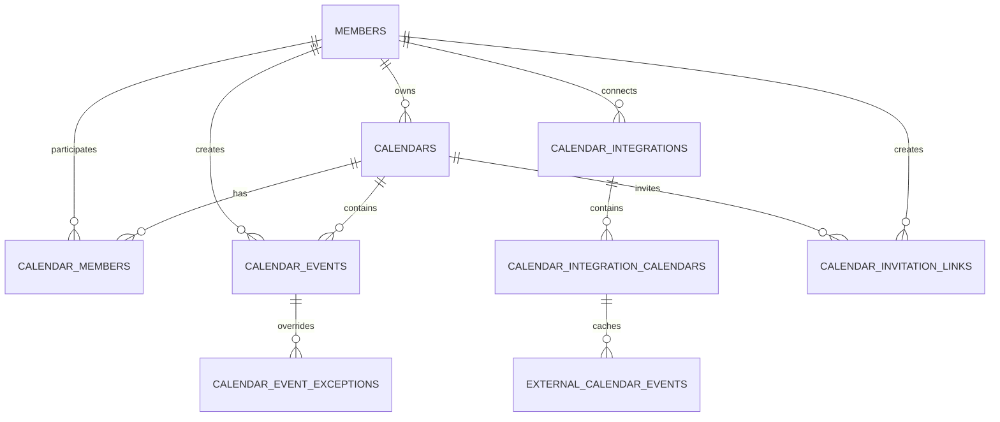

# Naru Calendar ERD

이 문서는 현재 Flyway migration `V5`~`V22` 기준이다. `NULL`은 nullable, `NN`은 `NOT NULL`, `PK`·`FK`·`UQ`는 각각 기본 키·외래 키·고유 제약을 뜻한다. enum 값의 상세는 도메인 코드와 아래 정책 문서를 함께 확인한다.

## `calendars`

개인 또는 공유 일정 공간이다. `calendar_type`은 `PERSONAL` 또는 `SHARED`이며, `is_default`는 새 일정의 기본 개인 캘린더 표시용 값이다.

| 컬럼 | 타입 | NULL | 기본값 | 키·설명 |
| --- | --- | --- | --- | --- |
| `id` | BIGSERIAL | NN | 생성 | PK |
| `owner_member_id` | BIGINT | NN | - | FK -> `members.id`, RESTRICT, 소유자 |
| `name` | VARCHAR(100) | NN | - | 표시 이름 |
| `calendar_type` | VARCHAR(30) | NN | - | 개인·공유 구분 |
| `display_color` | VARCHAR(20) | NN | `#20b977` | 목록·새 일정의 기본 표시 색상 |
| `is_default` | BOOLEAN | NN | `FALSE` | 기본 개인 캘린더 여부 |
| `created_at`, `updated_at` | TIMESTAMP | NN | CURRENT_TIMESTAMP | 생성·수정 시각 |

Index: `idx_calendars_owner_member(owner_member_id)`.

## `calendar_members`

캘린더 참여 관계와 역할이다. 개인 캘린더의 OWNER도 이 테이블에 있다.

| 컬럼 | 타입 | NULL | 기본값 | 키·설명 |
| --- | --- | --- | --- | --- |
| `id` | BIGSERIAL | NN | 생성 | PK |
| `calendar_id` | BIGINT | NN | - | FK -> `calendars.id`, CASCADE |
| `member_id` | BIGINT | NN | - | FK -> `members.id`, RESTRICT |
| `member_role` | VARCHAR(30) | NN | - | `OWNER`·`EDITOR`·`VIEWER` |
| `created_at` | TIMESTAMP | NN | CURRENT_TIMESTAMP | 참여 시각 |

Constraints/indexes: `UQ(calendar_id, member_id)`, `idx_calendar_members_member(member_id)`.

## `calendar_events`

Naru 내부 단일·기간·반복 일정의 원본이다. 반복 회차는 별도 행이 아니라 조회 시 계산한다.

| 컬럼 | 타입 | NULL | 기본값 | 키·설명 |
| --- | --- | --- | --- | --- |
| `id` | BIGSERIAL | NN | 생성 | PK |
| `calendar_id` | BIGINT | NN | - | FK -> `calendars.id`, RESTRICT, 소속 캘린더 |
| `created_by_member_id` | BIGINT | NN | - | FK -> `members.id`, RESTRICT, 최초 생성자 |
| `title` | VARCHAR(100) | NN | - | 제목 |
| `description` | TEXT | NULL | - | 설명 |
| `start_at`, `end_at` | TIMESTAMP | NN | - | 일정 구간 |
| `all_day` | BOOLEAN | NN | - | 종일 여부 |
| `location` | VARCHAR(255) | NULL | - | 장소 |
| `color` | VARCHAR(20) | NN | - | 일정 표시 색상 |
| `recurrence_rule` | VARCHAR(30) | NN | - | 반복 규칙 |
| `recurrence_end_at` | TIMESTAMP | NULL | - | 반복 종료 시각 |
| `recurrence_lunar_month`, `recurrence_lunar_day` | INTEGER | NULL | - | 음력 연간 반복 기준 |
| `status` | VARCHAR(30) | NN | - | 일정 상태 |
| `created_at`, `updated_at` | TIMESTAMP | NN | CURRENT_TIMESTAMP | 생성·수정 시각 |

Indexes: `idx_calendar_events_creator_start_at(created_by_member_id, start_at)`, `idx_calendar_events_calendar_start_at(calendar_id, start_at)`.

## `calendar_event_exceptions`

반복 일정의 특정 회차 취소 또는 값 재정의다.

| 컬럼 | 타입 | NULL | 기본값 | 키·설명 |
| --- | --- | --- | --- | --- |
| `id` | BIGSERIAL | NN | 생성 | PK |
| `calendar_event_id` | BIGINT | NN | - | FK -> `calendar_events.id`, CASCADE |
| `occurrence_start_at` | TIMESTAMP | NN | - | 원본 기준 대상 회차 시작 시각 |
| `exception_type` | VARCHAR(30) | NN | - | 취소·재정의 구분 |
| `title`, `description`, `start_at`, `end_at`, `all_day`, `location`, `color` | 각 원본과 동일 | NULL | - | 재정의일 때만 사용 |
| `created_at`, `updated_at` | TIMESTAMP | NN | CURRENT_TIMESTAMP | 생성·수정 시각 |

Constraints/indexes: `UQ(calendar_event_id, occurrence_start_at)`, `idx_calendar_event_exceptions_event(calendar_event_id)`.

## `calendar_holiday_overrides`

법정·대체공휴일 계산 결과를 운영자가 보정하는 전역 날짜 데이터다.

| 컬럼 | 타입 | NULL | 기본값 | 키·설명 |
| --- | --- | --- | --- | --- |
| `id` | BIGSERIAL | NN | 생성 | PK |
| `holiday_date` | DATE | NN | - | UQ, 대상 양력 날짜 |
| `operation` | VARCHAR(10) | NN | - | CHECK `ADD`·`REMOVE` |
| `holiday_name` | VARCHAR(100) | NULL | - | `ADD`일 때 필수 |
| `reason` | VARCHAR(255) | NULL | - | 운영 근거 |
| `created_at`, `updated_at` | TIMESTAMP | NN | CURRENT_TIMESTAMP | 생성·수정 시각 |

Constraints: `UQ(holiday_date)`, `ADD`일 때 `holiday_name` 필수 CHECK.

## `calendar_integrations`

회원이 연결한 Google OAuth 계정이다. refresh token은 암호문만 저장하며 null은 연결 복구가 필요한 상태에 허용된다.

| 컬럼 | 타입 | NULL | 기본값 | 키·설명 |
| --- | --- | --- | --- | --- |
| `id` | BIGSERIAL | NN | 생성 | PK |
| `member_id` | BIGINT | NN | - | FK -> `members.id` |
| `provider` | VARCHAR(30) | NN | - | CHECK `GOOGLE` |
| `provider_account_id` | VARCHAR(255) | NN | - | Google 계정 식별자 |
| `provider_email` | VARCHAR(320) | NN | - | 계정 이메일 |
| `encrypted_refresh_token` | TEXT | NULL | - | AES-GCM 암호문 |
| `status` | VARCHAR(30) | NN | - | CHECK `CONNECTED`·`REVOKED`·`FAILED` |
| `last_sync_attempted_at`, `last_synced_at` | TIMESTAMP | NULL | - | 최근 시도·성공 시각 |
| `last_sync_error` | TEXT | NULL | - | 최근 실패 사유 |
| `created_at`, `updated_at` | TIMESTAMP | NN | - | 생성·수정 시각 |

Constraint: `UQ(member_id, provider, provider_account_id)`; 한 회원이 여러 Google 계정을 연결할 수 있다.

## `calendar_integration_calendars`

연결된 Google 계정 안의 하위 캘린더 선택과 증분 동기화 기준점이다.

| 컬럼 | 타입 | NULL | 기본값 | 키·설명 |
| --- | --- | --- | --- | --- |
| `id` | BIGSERIAL | NN | 생성 | PK |
| `calendar_integration_id` | BIGINT | NN | - | FK -> `calendar_integrations.id`, CASCADE |
| `provider_calendar_id` | VARCHAR(500) | NN | - | Google Calendar ID |
| `calendar_name` | VARCHAR(255) | NN | - | Google 표시 이름 |
| `calendar_color` | VARCHAR(20) | NULL | - | Google 제공 색상 |
| `enabled` | BOOLEAN | NN | `FALSE` | NaruWorks 표시·동기화 여부 |
| `last_synced_at` | TIMESTAMP | NULL | - | 이 하위 캘린더 마지막 성공 시각 |
| `sync_token` | TEXT | NULL | - | Google 증분 동기화 기준점 |
| `created_at`, `updated_at` | TIMESTAMP | NN | CURRENT_TIMESTAMP | 생성·수정 시각 |

Constraints/indexes: `UQ(calendar_integration_id, provider_calendar_id)`, `idx_calendar_integration_calendars_integration_id(calendar_integration_id)`.

## `external_calendar_events`

Google 원본의 읽기 전용 저장본이다.

| 컬럼 | 타입 | NULL | 기본값 | 키·설명 |
| --- | --- | --- | --- | --- |
| `id` | BIGSERIAL | NN | 생성 | PK |
| `calendar_integration_calendar_id` | BIGINT | NN | - | FK -> `calendar_integration_calendars.id`, CASCADE |
| `provider_event_id` | VARCHAR(1024) | NN | - | Google Event ID |
| `title` | VARCHAR(255) | NN | - | 제목 |
| `description` | TEXT | NULL | - | 설명 |
| `start_at`, `end_at` | TIMESTAMP | NN | - | 일정 구간 |
| `all_day` | BOOLEAN | NN | - | 종일 여부 |
| `location` | VARCHAR(500) | NULL | - | 장소 |
| `color` | VARCHAR(20) | NULL | - | 이벤트 또는 캘린더 색상 |
| `provider_updated_at` | TIMESTAMP | NULL | - | Google 원본 수정 시각 |
| `created_at`, `updated_at` | TIMESTAMP | NN | CURRENT_TIMESTAMP | 저장본 생성·수정 시각 |

Constraints/indexes: `UQ(calendar_integration_calendar_id, provider_event_id)`, `idx_external_calendar_events_calendar_start_at(calendar_integration_calendar_id, start_at)`.

## `calendar_invitation_links`

공유 캘린더 참여 권한을 전달하는 단기 링크다. 원문 token은 저장하지 않는다.

| 컬럼 | 타입 | NULL | 기본값 | 키·설명 |
| --- | --- | --- | --- | --- |
| `id` | BIGSERIAL | NN | 생성 | PK |
| `calendar_id` | BIGINT | NN | - | FK -> `calendars.id`, CASCADE |
| `created_by_member_id` | BIGINT | NN | - | FK -> `members.id`, RESTRICT |
| `token_hash` | VARCHAR(64) | NN | - | SHA-256 해시, UQ |
| `member_role` | VARCHAR(30) | NN | - | 수락자 역할 `EDITOR`·`VIEWER` |
| `expires_at` | TIMESTAMP | NN | - | 발급 후 7일 만료 |
| `revoked_at` | TIMESTAMP | NULL | - | OWNER 폐기 시각 |
| `created_at` | TIMESTAMP | NN | CURRENT_TIMESTAMP | 발급 시각 |

Indexes: `UQ(token_hash)`, 부분 index `idx_calendar_invitation_links_calendar_active(calendar_id, expires_at) WHERE revoked_at IS NULL`.
