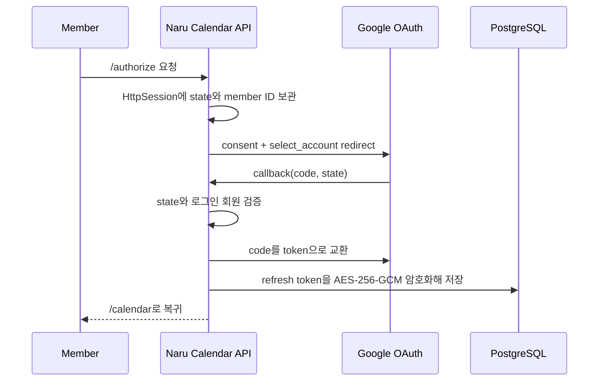

# Naru Calendar Google Calendar 연동

## 범위

Google Calendar 연동은 NaruWorks 로그인 OAuth와 별도 OAuth 클라이언트로 동작한다. 회원이 Calendar 화면에서 필요할 때만 읽기 권한을 승인한다.

연결에 필요한 환경 변수는 `GOOGLE_CALENDAR_CLIENT_ID`, `GOOGLE_CALENDAR_CLIENT_SECRET`, `GOOGLE_CALENDAR_REDIRECT_URI`, `GOOGLE_CALENDAR_TOKEN_ENCRYPTION_KEY`와 서비스의 `naru.frontend-base-url`이다. 주기 동기화는 `NARU_GOOGLE_CALENDAR_SYNC_ENABLED`, `NARU_GOOGLE_CALENDAR_SYNC_INITIAL_DELAY`, `NARU_GOOGLE_CALENDAR_SYNC_FIXED_DELAY`로 조정한다. 비밀 값은 배포 환경 변수에만 두고 Git에 기록하지 않는다.

```text
지원
= 여러 Google 계정 연결
= 계정별 하위 Calendar 표시 선택
= Google -> NaruWorks 단방향 읽기 동기화

미지원
= NaruWorks 일정의 Google 생성·수정·삭제
= 양방향 동기화와 충돌 해결
```

## 연결 흐름



연결 정보는 `calendar_integrations`에 계정별로 저장한다. 같은 `provider_account_id`를 다시 연결하면 새 계정을 중복 생성하지 않고 재연결로 처리한다.

## 계정과 하위 캘린더

```text
Google 계정 연결
= 회사·개인 등 OAuth 연결 단위
= 왼쪽 패널의 접힌 상위 그룹

Google 하위 캘린더
= 기본·가족·업무 등 실제 일정 선택 단위
= enabled, 제공자 색상, sync token을 별도 관리
```

Naru 내부 개인·공유 캘린더와 Google 하위 캘린더는 화면에서 함께 표시되지만 소유권과 권한 모델은 분리한다. Google 일정은 연결한 회원만 볼 수 있고 공유 캘린더에 자동 포함되지 않는다.

## 동기화 정책

```text
최초 동기화
= 전체 Event 목록을 페이지 끝까지 읽고 external_calendar_events에 저장
= 마지막 nextSyncToken을 calendar_integration_calendars.sync_token에 저장

증분 동기화
= syncToken 이후 변경된 추가·수정·취소 이벤트만 읽음
= 추가·수정은 provider_event_id 기준 upsert
= 취소는 저장본에서 제거

토큰 만료
= Google HTTP 410이면 전체 동기화로 기준점 복구
```

Spring Scheduler는 애플리케이션 시작 1분 뒤부터 실행 완료 기준 30분 `fixedDelay`로 동기화한다. 이는 회원마다 따로 실행하는 방식이 아니라 서버 전체 연결을 순차 처리하는 방식이다. 화면의 일정 조회 API는 Google을 직접 호출하지 않고 저장된 `external_calendar_events`만 읽는다.

동기화 대상은 `provider=GOOGLE`, `status=CONNECTED`이며 `enabled=true`인 하위 캘린더가 하나 이상 있는 연결이다. Google 목록·이벤트 API의 page token은 마지막 페이지까지 순회한다. Google 호출이 실패해도 기존 저장본은 유지해 Calendar 화면이 비어 보이지 않게 한다.

## 실패·재시도·연결 해제

- 연결별 최근 시도, 마지막 성공 시각, 최근 실패 사유를 보관하고 화면에 표시한다.
- 일반 조회 때 access token이 만료되면 암호화 refresh token으로 자동 갱신한다.
- 동기화 실패는 연결 자체를 해제하지 않는다. 다음 30분 주기나 사용자의 수동 동기화에서 재시도한다.
- 연결 해제 시 Google 권한 철회를 요청하고, 성공 여부와 무관하게 NaruWorks의 암호화 refresh token, 하위 캘린더 선택, 외부 일정 저장본을 제거한다.

현재 scheduler는 단일 backend 인스턴스를 전제로 한다. backend를 여러 대로 늘릴 때는 같은 연결이 동시에 동기화되지 않도록 분산 잠금 또는 queue를 도입한다.

## 보안 경계

- access token은 DB에 저장하지 않는다.
- refresh token은 AES-256-GCM 암호화 저장하고 API 응답·로그·Git에 남기지 않는다.
- OAuth state는 CSRF 방지용 난수이며 추천 코드와 다른 목적의 세션 값이다.
- 필요한 환경 변수는 `.env`에만 두며, `GOOGLE_CALENDAR_TOKEN_ENCRYPTION_KEY`는 Base64 인코딩된 32바이트 AES 키를 사용한다.

변경 배경의 학습 자료는 `docs/change-explanations/2026-09-10-google-calendar-oauth-connection.html`, `2026-09-10-google-calendar-multiple-selection.html`, `2026-09-11-google-calendar-event-import.html`을 참고한다.
