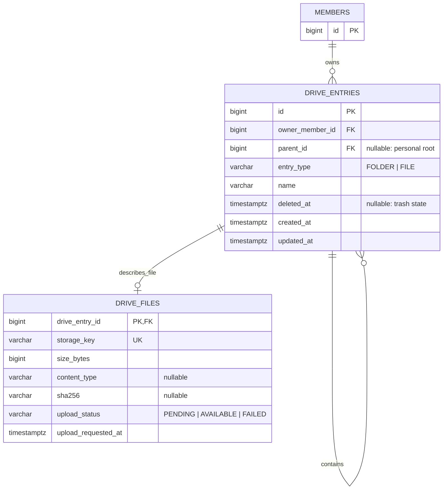

# Naru Drive MVP 도메인 모델

## 결정 요약

| 항목 | 결정 | 이유 |
| --- | --- | --- |
| 트리 모델 | `drive_entries` 하나로 파일·폴더의 공통 트리를 표현 | 폴더 목록 조회와 이후 공유 권한 연결을 단순화 |
| 파일 전용 정보 | `drive_files`로 분리 | 폴더에 불필요한 저장 객체·크기·MIME 컬럼을 두지 않음 |
| 루트 | `parent_id = NULL`인 논리적 개인 루트 | 사용자마다 보이지 않는 루트 행을 만들지 않음 |
| 소유권 | 모든 entry는 한 명의 `owner_member_id`를 가짐 | MVP는 개인 Drive만 제공 |
| 이름 중복 | 같은 소유자·같은 부모의 활성 entry는 동명 불가 | 파일과 폴더를 찾고 업로드 결과를 예측하기 쉬움 |
| 삭제 | 휴지통으로 소프트 삭제 후 30일 보관 | 오삭제 복구 가능 |
| 공유 | MVP에서는 제외 | 권한 테이블과 공유 링크는 다음 단계에서 추가 |

## ERD



`DRIVE_ENTRIES.parent_id`는 같은 테이블의 `id`를 참조한다. `parent_id = NULL`은 특정 회원의 논리적 루트이며, 실제 “내 Drive” 폴더 행은 만들지 않는다.

## 테이블 명세

### `drive_entries`

파일·폴더 화면에 보이는 공통 항목과 트리 구조를 책임진다.

| 컬럼 | 물리 타입 | Null | 기본값 | 설명 |
| --- | --- | --- | --- | --- |
| `id` | `BIGSERIAL` | 불가 | 자동 생성 | 내부 식별자 |
| `owner_member_id` | `BIGINT` | 불가 | 없음 | `members.id`를 참조하는 개인 Drive 소유자 |
| `parent_id` | `BIGINT` | 가능 | `NULL` | 상위 폴더. `NULL`이면 소유자의 루트 |
| `entry_type` | `VARCHAR(20)` | 불가 | 없음 | `FOLDER` 또는 `FILE` |
| `name` | `VARCHAR(255)` | 불가 | 없음 | 화면에 표시하는 파일·폴더 이름 |
| `deleted_at` | `TIMESTAMPTZ` | 가능 | `NULL` | 휴지통 이동 시각. `NULL`이면 활성 상태 |
| `created_at` | `TIMESTAMPTZ` | 불가 | `CURRENT_TIMESTAMP` | 생성 시각 |
| `updated_at` | `TIMESTAMPTZ` | 불가 | `CURRENT_TIMESTAMP` | 이름·부모 변경 시각 |

제약과 index:

```text
PK: drive_entries.id
FK: owner_member_id -> members.id ON DELETE RESTRICT
FK: parent_id -> drive_entries.id ON DELETE RESTRICT
CHECK: entry_type IN ('FOLDER', 'FILE')
UNIQUE INDEX: (owner_member_id, COALESCE(parent_id, 0), name) WHERE deleted_at IS NULL
INDEX: (owner_member_id, parent_id, name) WHERE deleted_at IS NULL
```

`COALESCE(parent_id, 0)`를 사용하면 PostgreSQL이 `NULL`을 서로 다른 값으로 취급하는 특성 때문에 루트에서 동명 entry가 여러 개 생기는 일을 막는다. 이 unique index는 같은 소유자·같은 폴더 안의 활성 파일과 폴더를 함께 검사한다.

별도의 `(owner_member_id, parent_id, name)` partial index는 현재 폴더의 자식을 목록으로 읽을 때 쓴다. unique index는 `COALESCE` 표현식을 사용하므로, 일반적인 `parent_id = :parentId` 목록 쿼리까지 맡기지 않는다.

### `drive_files`

`entry_type = FILE`인 entry에만 하나씩 존재하며, 실제 객체 저장소와의 연결 정보를 책임진다.

| 컬럼 | 물리 타입 | Null | 기본값 | 설명 |
| --- | --- | --- | --- | --- |
| `drive_entry_id` | `BIGINT` | 불가 | 없음 | `drive_entries.id`를 참조하는 파일 entry. PK이기도 함 |
| `storage_key` | `VARCHAR(512)` | 불가 | 없음 | RustFS 객체 키. 사용자가 입력한 파일명은 포함하지 않음 |
| `size_bytes` | `BIGINT` | 불가 | `0` | 업로드 예정 또는 확정된 바이트 수 |
| `content_type` | `VARCHAR(255)` | 가능 | `NULL` | 브라우저가 보낸 MIME 타입. 신뢰 경계는 별도 검증 |
| `sha256` | `VARCHAR(64)` | 가능 | `NULL` | 향후 무결성 검증용 SHA-256 |
| `upload_status` | `VARCHAR(20)` | 불가 | `PENDING` | `PENDING`, `AVAILABLE`, `FAILED` |
| `upload_requested_at` | `TIMESTAMPTZ` | 불가 | `CURRENT_TIMESTAMP` | 업로드 예약 시각. 중단·실패 업로드 정리 기준 |

제약과 index:

```text
PK/FK: drive_entry_id -> drive_entries.id ON DELETE RESTRICT
UNIQUE: storage_key
CHECK: size_bytes >= 0
CHECK: upload_status IN ('PENDING', 'AVAILABLE', 'FAILED')
INDEX: (upload_status, upload_requested_at)
```

`storage_key`는 DB의 `drive_entry_id`와 다른 책임을 가진다. `drive_entry_id`는 PostgreSQL의 파일 메타데이터를 찾는 내부 식별자이고, `storage_key`는 RustFS에서 실제 파일 바이트를 `PUT`, `GET`, `DELETE`할 때 필요한 물리 객체 주소다. 파일 이름 변경이나 폴더 이동 뒤에도 객체를 복사·이동하지 않도록 `storage_key`는 UUID 기반으로 고정한다. `UNIQUE(storage_key)`는 서로 다른 파일 entry가 실수로 같은 실제 객체를 가리키는 것을 막는다.

`upload_status`만을 단독으로 index로 만들면 값 종류가 세 개뿐이라 효율이 낮다. 정리 배치가 실제로 찾는 대상은 “특정 상태이면서 오래된 업로드”이므로, `upload_status`와 `upload_requested_at`을 함께 둔 복합 index를 사용한다. PostgreSQL과 MySQL 등에서 같은 방식으로 사용할 수 있으며, 배치가 생기기 전에는 migration에 넣지 않고 해당 배치 이슈에서 추가한다. 30일 휴지통 정리 job과 별도로, 이 index는 중단된 업로드 객체·예약 용량을 더 이른 시간에 정리할 때 사용한다.

## 권한 규칙

MVP에서는 공유를 만들지 않는다. 인증된 회원 `currentMemberId`가 `owner_member_id`와 같을 때만 읽기·생성·수정·다운로드·휴지통 이동을 허용한다.

```text
대상 entry가 없음 또는 소유자가 다름 = 404 Not Found
상위 폴더가 없거나 FOLDER가 아님 = 400 Bad Request
상위 폴더의 소유자가 다름 = 404 Not Found
```

다른 회원의 entry 존재 여부를 드러내지 않기 위해 소유권 불일치는 `403` 대신 `404`로 응답한다.

## 휴지통 정책

- 파일 또는 폴더 삭제는 즉시 RustFS 객체를 삭제하지 않고 `deleted_at`을 기록한다.
- 폴더를 휴지통으로 옮기면 하위 entry도 함께 휴지통으로 옮긴다.
- 휴지통 목록에서는 같은 소유자의 삭제 항목만 조회한다.
- 30일 뒤 영구 삭제 대상이 된다. 실제 정리 job은 휴지통 API 다음 이슈에서 구현한다.
- 영구 삭제 시 DB 메타데이터와 RustFS 객체를 함께 정리한다. 한쪽 실패 시 재시도 가능한 상태를 남긴다.

## 이후 공유 확장

공유 기능은 기존 `drive_entries`에 nullable 컬럼을 추가하는 방식이 아니다. 한 파일·폴더를 여러 회원에게 각각 다른 역할로 공유해야 하므로, 다음 migration에서 별도 관계 테이블 `drive_entry_permissions`를 **새로 만든다**.

| 컬럼 | 설명 |
| --- | --- |
| `id` | 권한 행 내부 식별자 |
| `entry_id` | 공유를 시작하는 파일 또는 폴더 |
| `member_id` | 권한을 받은 회원 |
| `role` | `VIEWER` 또는 `EDITOR` |
| `granted_by_member_id` | 권한을 부여한 소유자 |
| `created_at`, `updated_at` | 권한 부여·변경 시각 |

```text
UNIQUE(entry_id, member_id)
INDEX(member_id, entry_id)
FK(entry_id -> drive_entries.id)
FK(member_id -> members.id)
FK(granted_by_member_id -> members.id)
```

초기 공유 정책은 다음처럼 확장한다.

- 소유자는 별도 권한 행 없이 항상 모든 권한을 가진다.
- 소유자만 공유 초대·역할 변경·권한 해제를 할 수 있다. `EDITOR`는 파일·폴더를 수정할 수 있지만 공유 관리는 할 수 없다.
- 폴더에 부여한 권한은 그 하위 entry에 상속된다. 권한 확인 시 대상 entry에서 루트까지 조상을 따라가며 해당 회원의 권한을 찾는다.
- 직접 부여한 권한과 상속 권한이 모두 있으면 더 강한 `EDITOR`를 적용한다. 거부 규칙이나 복잡한 예외 권한은 첫 공유 단계에 넣지 않는다.
- 공유된 폴더 밖으로 파일을 이동하면 상속 권한은 사라지고, 공유된 폴더 안으로 이동하면 해당 폴더의 권한이 적용된다.

공유 링크는 회원 권한 공유와 별도의 `drive_share_links` 테이블로 추가한다. 만료 시각, 비밀번호 해시, 링크 토큰 해시, 허용 역할을 관리하며 영구 공개 링크는 만들지 않는다.
