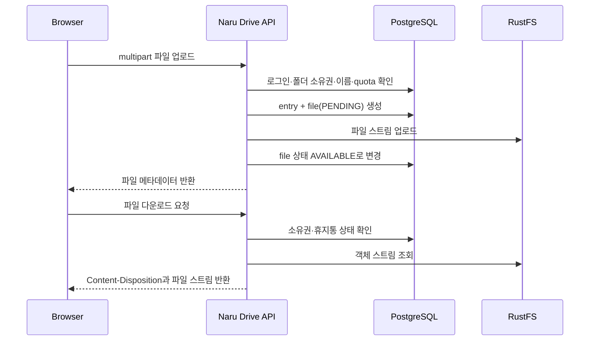

# Naru Drive 저장소와 파일 전송 정책

## 현재 개발 구성

```text
Browser
  -> Naru backend
  -> Docker 내부 RustFS S3 API (rustfs:9000)
  -> naruworks-drive-data named volume
```

RustFS는 AWS S3 서비스가 아니라 S3 API를 구현한 개발용 Object Storage 서버다. `9000`은 Docker Compose 내부에서만 backend가 접근하며, 인터넷이나 집 내부망에 공개하지 않는다. `9001` 관리 Console도 홈서버 `127.0.0.1`에서만 연다.

## MVP 파일 전송: backend 중계

MVP에서는 브라우저가 RustFS에 직접 연결하지 않는다.



이 방식을 택하는 이유는 현재 S3 API가 private이기 때문이다. backend가 인증·권한·용량을 한 곳에서 판단하고, RustFS를 외부에 노출하지 않아도 된다.

## 객체 키 규칙

사용자 파일명이나 폴더 경로를 RustFS 객체 키에 사용하지 않는다.

```text
members/{ownerMemberId}/files/{driveEntryId}/{randomUuid}
```

- 이름 변경·이동은 PostgreSQL의 `drive_entries.name`, `parent_id`만 바꾼다.
- 같은 이름 파일의 충돌과 경로 조작을 피한다.
- 객체 키는 API 응답이나 URL 경로로 사용자에게 노출하지 않는다.

## 용량과 파일 형식

| 정책 | MVP 기본값 | 비고 |
| --- | --- | --- |
| 단일 파일 최대 크기 | 50 MB | 환경 변수로 조정 가능 |
| 회원 총 사용량 | 1 GB | `PENDING`도 예약 용량으로 계산 |
| 파일 형식 | 허용 목록 없이 시작 | 실행 파일·위험 형식 차단은 업로드 구현 이슈에서 결정 |
| 파일명 | 최대 255자, 빈 이름 불가 | 경로 구분자와 제어 문자는 거절 |

MVP quota는 `PENDING`과 `AVAILABLE` 파일의 `size_bytes` 합으로 판단한다. 업로드 중단으로 `PENDING`이 남으면 별도 정리 job이 회수한다.

## 직접 업로드 전환 조건

파일 크기나 동시 업로드가 backend 부담이 될 때만 서명 URL 방식을 검토한다. 이때는 별도 S3 전용 hostname, HTTPS, CORS allowlist, URL 만료 시간, 객체 존재 확인을 설계해야 한다. 현재 MVP에서는 이 요소를 만들지 않는다.

## 개발 데이터 주의

`naruworks-drive-data` named volume은 컨테이너 재시작 뒤에도 남지만, `docker compose down -v`, volume 삭제, 호스트 장애에는 보호되지 않는다. 따라서 지금은 테스트 파일만 저장한다. 전용 HDD·백업·복원 절차를 갖춘 뒤에만 운영 파일을 받는다.
