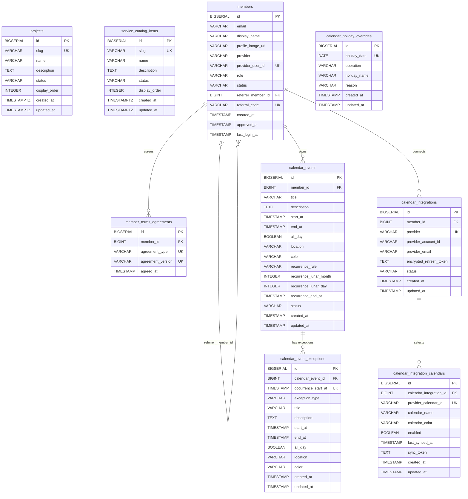

# NaruWorks 관계 ERD

기준일: 2026-09-10
기준 소스: `backend/naru-infrastructure/src/main/resources/db/migration`

이 문서는 **현재 PostgreSQL에 존재하는 모든 테이블의 관계**를 Mermaid로 표현한다.
컬럼 단위의 논리명, Nullable, 기본값, index 상세는 [ERD와 데이터 사전](erd.html)을 함께 확인한다.

## 테이블 역할

| 테이블 | 역할 | 관계 여부 |
| --- | --- | --- |
| `projects` | NaruWorks 공개 프로젝트 카탈로그 | 독립 테이블 |
| `service_catalog_items` | Naru Home 서비스 카탈로그 | 독립 테이블 |
| `members` | Google 기반 회원, 역할, 상태, 추천 관계의 기준 | 자기 참조 및 다수 자식 테이블 보유 |
| `member_terms_agreements` | 약관 유형·버전별 동의 이력 | `members` 참조 |
| `calendar_events` | 회원이 만든 단일·반복 일정 원본 | `members` 참조 |
| `calendar_event_exceptions` | 반복 일정의 특정 회차 취소 또는 재정의 | `calendar_events` 참조 |
| `calendar_holiday_overrides` | 공휴일 계산 결과에 대한 운영 ADD/REMOVE 예외 | 독립 테이블 |
| `calendar_integrations` | 회원별 외부 Calendar OAuth 연결 | `members` 참조 |
| `calendar_integration_calendars` | 연결된 Google 계정 안의 캘린더별 표시 선택과 동기화 지점 | `calendar_integrations` 참조 |

## 관계와 제약조건

| 관계 | 카디널리티 | DB 제약조건 | 삭제 정책 |
| --- | --- | --- | --- |
| `members.referrer_member_id -> members.id` | 추천인 0..1 : 가입자 0..N | FK `fk_members_referrer_member`, index `idx_members_referrer_member_id` | `ON DELETE RESTRICT` |
| `member_terms_agreements.member_id -> members.id` | 회원 1 : 약관 동의 0..N | FK, `UNIQUE(member_id, agreement_type, agreement_version)`, member_id index | `ON DELETE RESTRICT` |
| `calendar_events.member_id -> members.id` | 회원 1 : 일정 0..N | FK, `INDEX(member_id, start_at)` | `ON DELETE RESTRICT` |
| `calendar_event_exceptions.calendar_event_id -> calendar_events.id` | 원본 일정 1 : 회차 예외 0..N | FK, `UNIQUE(calendar_event_id, occurrence_start_at)`, event_id index | `ON DELETE CASCADE` |
| `calendar_integrations.member_id -> members.id` | 회원 1 : 제공자 연결 0..N | FK, `UNIQUE(member_id, provider)` | PostgreSQL 기본 `NO ACTION` |
| `calendar_integration_calendars.calendar_integration_id -> calendar_integrations.id` | OAuth 연결 1 : Google 캘린더 0..N | FK, `UNIQUE(calendar_integration_id, provider_calendar_id)`, integration_id index | `ON DELETE CASCADE` |

## 독립 테이블 제약조건

| 테이블 | 제약조건 / index | 의미 |
| --- | --- | --- |
| `projects` | `UNIQUE(slug)` | URL/API에서 프로젝트를 중복 없이 식별 |
| `service_catalog_items` | `UNIQUE(slug)` | 서비스 진입 경로를 중복 없이 식별 |
| `members` | `UNIQUE(provider, provider_user_id)`, `UNIQUE(referral_code)`, email/status index | Google 계정 중복 가입 방지와 추천 코드 식별 |
| `calendar_holiday_overrides` | `UNIQUE(holiday_date)`, operation/name CHECK | 한 날짜에 하나의 운영 예외만 두고 ADD/REMOVE 규칙 강제 |
| `calendar_integrations` | provider/status CHECK | 현재 제공자를 `GOOGLE`로, 상태를 허용 enum 범위로 제한 |
| `calendar_integration_calendars` | `UNIQUE(calendar_integration_id, provider_calendar_id)`, integration_id index | 한 Google 계정에서 같은 캘린더를 중복 저장하지 않음 |

## 현재 설계의 의도

- Google Calendar 연결 정보는 `calendar_events`에 섞지 않는다. 내부 일정의 수정 가능 모델과 외부 원본의 읽기 전용 모델이 다르기 때문이다.
- `calendar_integrations`는 Google 계정 연결과 refresh token만 관리하고, 여러 캘린더의 표시 선택·증분 동기화 지점은 `calendar_integration_calendars`가 관리한다.
- Google 일정 실제 가져오기 단계에서는 `external_calendar_events` 같은 별도 테이블을 추가할 예정이다.
- `calendar_holiday_overrides`는 회원 소유 데이터가 아니라 서비스 공통 날짜 메타데이터이므로 회원 FK가 없다.
- `projects`, `service_catalog_items`는 현재 공개 홈 카탈로그라 회원 데이터와 관계를 두지 않는다.
